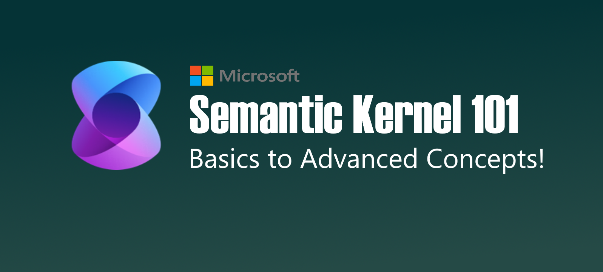

# Semantic-Kernel-101
## Learn Semantic Kernel using basics to advance concepts

## Goal
- To provide users with simple learning plans that allow you to quickly learn Semantic Kernel starting with the basic to advanced concepts 
- Use a lesson based approach for understanding of concepts that allow you to progressively learn advanced concepts 
- Allow much faster adoption of AI using by leveraging proven practices
- Provide users with reusable building blocks resulting in ability to deliver solutions faster

## Lessons
### [Lesson 1 - Why Semantic Kernel? - Building our first App?](./lessons/lesson-1/README.md)
In this lession we cover the fundimental concepts of Semantic Kernel and what is needed to build your first console app.

### [Lesson 2 - Prompts and Plugins](./lessons/lesson-2/README.md)
TBD

## Homework
[Lesson 1 - Homework](/homework/lesson-1/README.md)

[Lesson 2 - Homework](/homework/lesson-2/README.md)

## [Solutions](/solutions/README.md)
Each lesson will have a separate project in the Semantic-Kernel-101.sln.  If you need to see a working example for the lesson you can find them here.  The idea is that you do the homework, put hands on the keyboard and you create the project that that covers the topics outlined in each lesson.  If you need a little help you can use this solution to get you moving.
